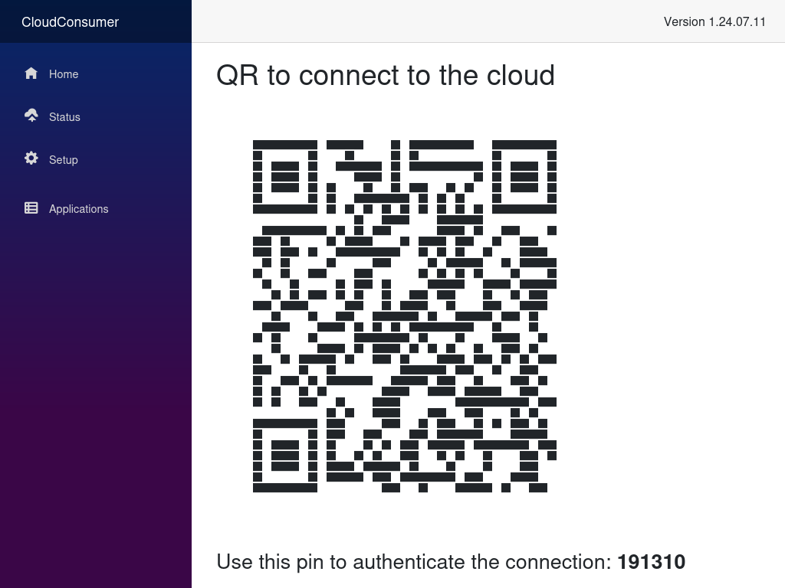

# Private Cloud
## Private Cloud storage (Virtual machine OVA image file)

This virtual machine is intended as a demonstration aimed at potential investor partners, it is a truly private cloud that allows anyone to own their data without handing over custody to third parties.
A device that, combined with the client software, allows you to remotely store your beacons, share them and navigate between them with browser and mobile applications.

### Cloud storage

- [Download virtual machine](http://bitboxlab.com/Resources/CloudConsumer.ova)
    - IMPORTANT: Contact me privately to obtain the activation code: http://t.me/kr7ge
 

### You can connect to the cloud with the following client software:

- [Desktop software (allows real-time folder synchronization)](https://github.com/Andrea-Bruno/CloudClient/releases)

- [Web file explorer (allows you to remotely browse files, upload and download files)](https://raw.githubusercontent.com/Andrea-Bruno/ProxyCloud/master/ClientHtml/CryptoCloudClientWeb.html) Note: Save content as a static HTML page  
    - [Description of the web file explorer and sources](https://github.com/Andrea-Bruno/ProxyCloud)

- Mobile application (a file explorer for iOS and Android) [Download APK](http://tc0.it/download/CloudClient.apk)

# Cloud Server project description

### Scalable and cross-platform cloud server technology
      
It is a library that allows one or more cloud systems to be instantiated on the fly, creating a scalable structure. Since this is a library, it has no graphical interface which must be developed by the developers based on the specifics of the required scenario. Having decoupled the client functions from the graphical interface, above this library it is possible to apply a graphical interface based on the technology that best suits the specific purpose of the cloud solution to be created, for example it is possible to add a web interface to create a cloud kiosk mode, or a cloud managed by windows panels, or purely software clouds whose interface is on a remote mobile app, etc.
Essentially CloudServer is a superior layer to the [CloudBox](https://github.com/Andrea-Bruno/CloudLibraries) library which being both a cloud server and client library does not implement the specific features only for the server, i.e. [CloudBox](https://github.com/Andrea-Bruno/CloudLibraries) only has common functions between client and server, while everything that is purely specific to the server (the cloud itself), is added with a software layer thanks to the CloudServer library.
The Cloud Server library implements server-specific functions, is written to be universal, i.e. it can run on both Windows and Linux operating systems, and adds features such as file thumbnails, license management, on-the-fly instantiation of new cloud, access pin management functions, diagnostic functions, generation of various types of QR code to pass the public key to the client and allow it to connect, descriptive report on system status, API for communication with a second encrypted protocol of communication (in addition to that provided by the underlying socket-type system), which allows a client to communicate with it through an innovative revamping of the Rest API protocol, to which encryption and key exchange with asymmetric encryption has been added, yes it is a protocol for communication with our encrypted proxy technology (normally a server that receives json requests, even if these are https, would be able to clearly see everything that passes because https creates a tunnel only up to the machine with which you interact with the post and get methods, instead encrypting the data that transits, with our solution the proxi will only act as a pass through without having the possibility of knowing anything of what transits.
Why have we implemented a protocol that requires a proxy? In many scenarios, for security reasons, you may not want to expose the cloud machine to the Internet, and prefer that the use of the post and get methods with the APIs take place via a machine exposed outside the infrastructure that acts as a proxy by resending the encrypted commands that receives in socchet mode to the cloud within a company intranet, the concept is to increase security by not exposing the cloud directly to the internet. In any case, with our software, the communication with the APIs must go through a proxy, which must have a static IP, while for the cloud the static IP address is not necessary since it is he who establishes the connection first, in this way it is also possible to create cloud servers that can work without a static IP or in areas covered by a firewall and interact with it from the outside using our encrypted proxy technology.
